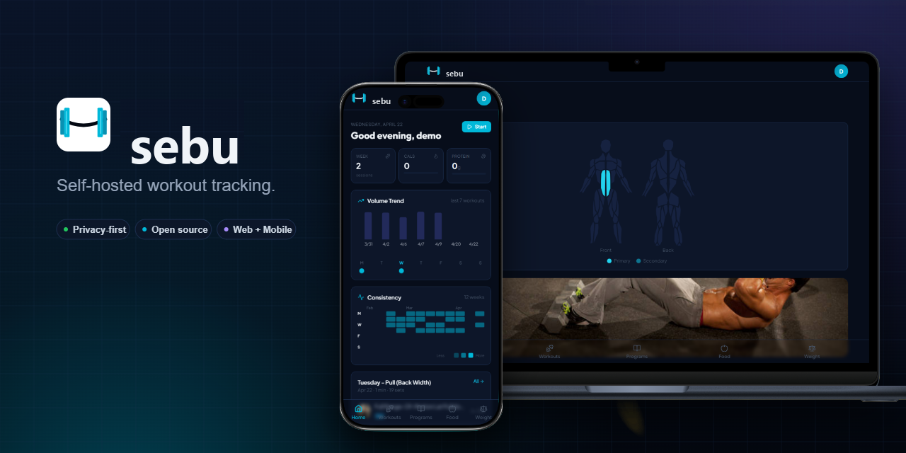
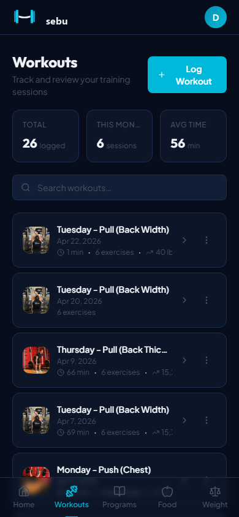
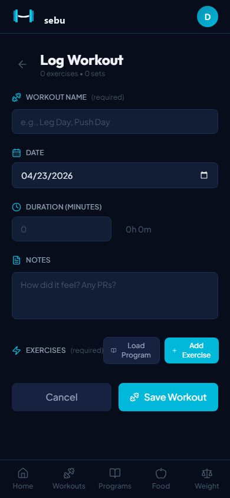
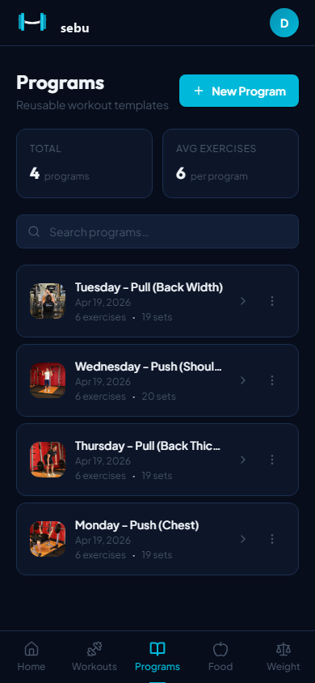
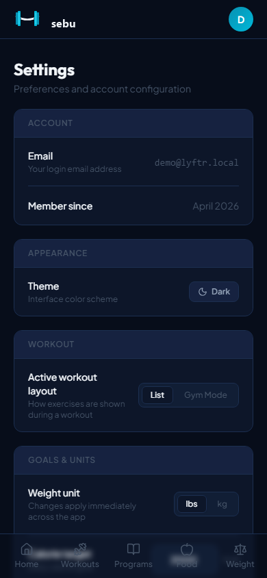

<p align="center">
  
</p>

<p align="center">
  <b>Self-hosted, mobile-first workout &amp; nutrition tracker.</b><br />
  Free, open source, and yours to run — own your data.
</p>

<p align="center">
  <a href="https://sebu-demo.fly.dev">Live demo</a> ·
  <a href="https://sebu-app.pages.dev">Docs</a> ·
  <a href="https://github.com/Cawlumm/sebu/releases?q=mobile-v">Download APK</a> ·
  <a href="https://discord.gg/hfFWsrebQA">Discord</a>
</p>

<p align="center">
  <a href="LICENSE"></a>
  
  <a href="https://selfh.st/weekly/2026-04-24/"></a>
  <a href="https://github.com/Cawlumm/sebu/releases?q=mobile-v"></a>
  
</p>

---

## What is Sebu?

A workout tracker you fully own. Log workouts, build reusable programs, run a guided gym session with
a rest timer, and track nutrition and bodyweight — all self-hosted and lightweight, with your data in
a single SQLite file on your server.

No subscription. No lock-in. No "your export is a Pro feature."

## Features

| | |
|---|---|
| 🏋️ **Workouts** | 800+ exercise library, program builder, guided active mode |
| 📱 **Gym Mode** | Full-screen, one exercise at a time, with a rest timer |
| 📈 **Progress** | Personal records, progression charts, muscle diagrams, dashboard |
| 🍎 **Nutrition** | Calories, macros, barcode scan, food search |
| ⚖️ **Weight** | Trend graph, lbs / kg across all data |
| 🔒 **Yours** | Self-hosted — a single SQLite file, all data on your server |

_Planned: PWA · Strong/Hevy CSV import · iOS app._

<p align="center">
  
  
  
  
  
</p>

## Quick start

No clone, no build — just Docker:

```bash
curl -o docker-compose.yml https://raw.githubusercontent.com/Cawlumm/sebu/main/docker-compose.yml
curl -o .env https://raw.githubusercontent.com/Cawlumm/sebu/main/.env.example
# set a strong JWT_SECRET in .env, then pull the prebuilt images and start:
docker compose pull && docker compose up -d
```

Open `http://localhost` and create your account.

📖 **Full guide** — configuration, HTTPS, backups, the mobile app, and troubleshooting live in the
**[docs → sebu-app.pages.dev](https://sebu-app.pages.dev)**.

## Try it

- **Live demo** — [sebu-demo.fly.dev](https://sebu-demo.fly.dev) · `demo@sebu.local` / `password123` (resets hourly)
- **Android** — [download the APK](https://github.com/Cawlumm/sebu/releases?q=mobile-v), then point it at your server ([mobile docs](https://sebu-app.pages.dev/mobile/)). iOS is planned.

## Roadmap

- [x] Workouts, programs, gym mode, rest timer
- [x] Exercise PRs, progression charts, dashboard
- [x] Weight + nutrition tracking
- [x] Docker deploy · Android app · docs site
- [ ] PWA · Strong/Hevy CSV import · iOS app · hosted option

## Tech stack

Go · Gin · SQLite — React · TypeScript · Tailwind · Vite (web) — React Native · Expo (mobile) —
Astro · Starlight (docs) — Docker · nginx.

## Contributing

Bug reports, feature requests, and PRs are welcome — open an issue before large changes. Development
setup and architecture notes live in [`docs/`](docs/).

> **Beta** — actively built, expect rough edges and frequent updates. The software equivalent of
> going to the gym for the first time.

## License

[MIT](LICENSE)
